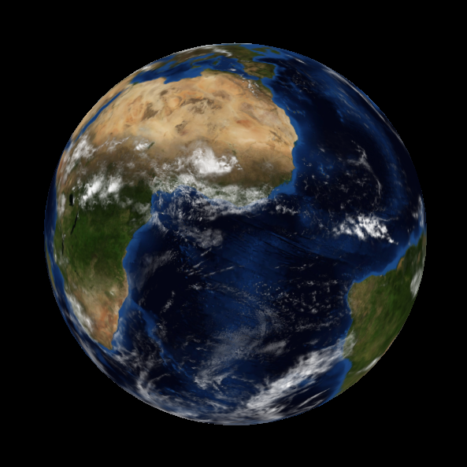
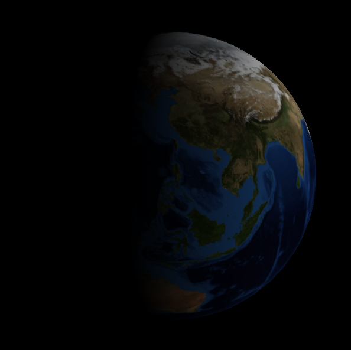
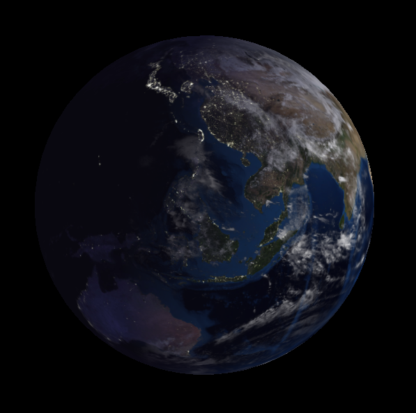

# EarthOpenGL

This is a simple OpenGL project that renders a sphere with a combinaison of different textures on it, especially a normal map, that gives the illusion of a bump map.

This project is based on the course of Pierre Benard and Gaël Guennebaud, call "Monde 3D" at the University of Bordeaux.

## Libraries
- [GLFW](https://www.glfw.org/)
- [GLAD](https://glad.dav1d.de/)
- [GLM](https://glm.g-truc.net/0.9.9/index.html)
- [SOIL](http://www.lonesock.net/soil.html)

## Results

